## Dados e abordagem

**Fontes de dados:** \

- SIM — Sistema de Informações sobre Mortalidade\
- SIH/SUS — Sistema de Informações Hospitalares do SUS\
- SINASC — Sistema de Informações sobre Nascidos Vivos\

**Período:** 2015 a 2024

[@datasus_sim]

## Dados e abordagem

**Faixas etárias:** \

- Visão geral: \
    - Menos de 1 ano;\
    - De 1 ano até menos que cinco anos;\
    - 5 e 6 anos.\

- Visão detalhada:\
    - Neonatal:\
        - Neonatal precoce: 0–6 dias;\
        - Neonatal tardia: 7–27 dias;\
        - Pós-neonatal: 28 dias a \<1 ano.\
    - Crianças:\
        - 1 a \< 2 anos;\
        - 2 a \< 5 anos;\
        - 5 e 6 anos.

[@UNIGME2024], [@brasil2026calendario], [@francca2009mortalidade]

## Dados e abordagem

- **Unidade de medida das taxas:** as taxas são expressas por 1.000 nascidos vivos da SINASC\

- **Polos de referência:** os diagnósticos são segmentados em grupos de alta complexidade:\

    - Oncologia;\
    - Cardiopatias congênitas;\
    - Malformações;\
    - Doenças do sistema nervoso, metabólicas ou genéticas.\

- **Afecções perinatais** são analisadas em separado, pois parte do evento perinatal recebido nos polos reflete o local de parto e não o deslocamento da criança em busca de tratamento.\

- **Referência terapêutica** de alta complexidade *sem* perinatal é o fluxo para identificar centros de referência e vazios assistenciais.\

## Evolução da Mortalidade

- Mortalidade em menores de 1 ano é dominante, a taxa é quase 9 vezes superior à faixa de 1 a 4 anos
- Tendência de queda moderada no período, com desaceleração após a pandemia
- Crianças de 5 e 6 anos apresentam taxas muito reduzidas, menos que 0,5 por mil nascidos vivos
- Queda absoluta nos óbitos de menores de 1 ano foi de 32 mil para 30 mil no período

## Evolução da Mortalidade na Primeira Infância

:::: {.columns}
::: {.column width="50%"}
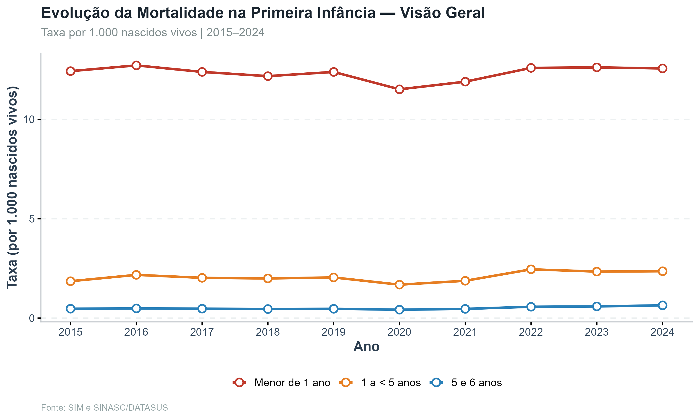{width="100%"}
:::
::: {.column width="50%"}
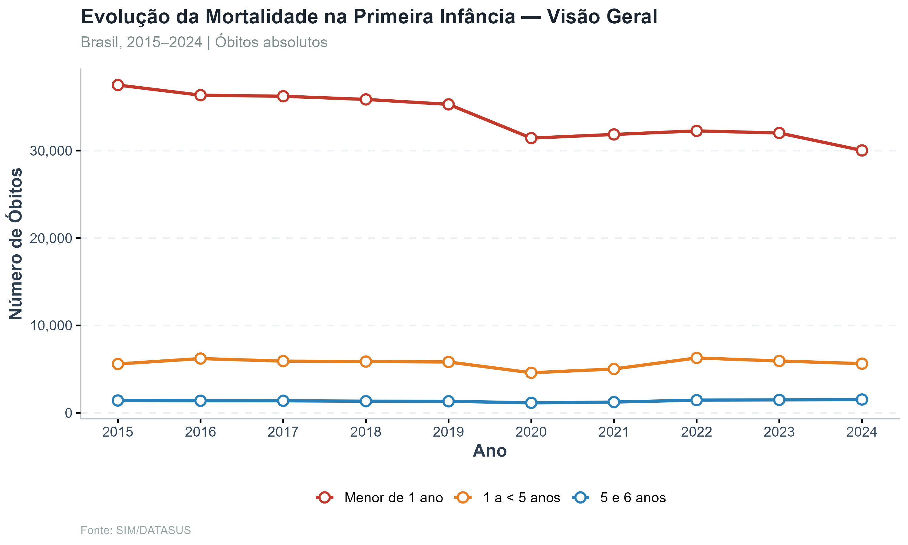{width="100%"}
:::
::::

## Mortalidade Neonatal

- Neonatal precoce apresenta o declínio mais expressivo
- Neonatal tardio permanece relativamente estável; queda após a pandemia
- Cada componente contribui com 5 mil a 15 mil óbitos por ano; soma supera 25 mil no período recente

## Evolução da Mortalidade no Neonatal

:::: {.columns}
::: {.column width="50%"}
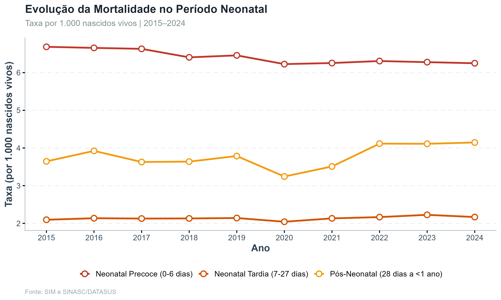{width="100%"}
:::
::: {.column width="50%"}
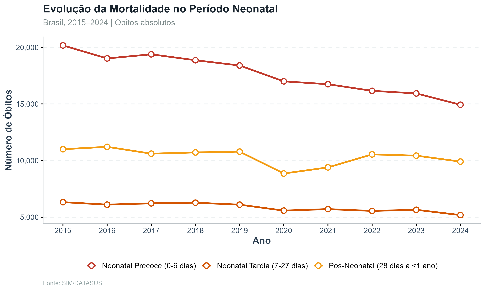{width="100%"}
:::
::::

## Mortalidade em Crianças (1 a 6 anos)

- Crianças de 1 a menos de 2 anos têm a maior taxa no grupo
- Tendência de alta nas taxas após pandemia
- Óbitos totais neste grupo: 8 mil a 10 mil por ano, muito abaixo dos quase 30 mil de menores de 1 ano

## Evolução da Mortalidade para Crianças

:::: {.columns}
::: {.column width="50%"}
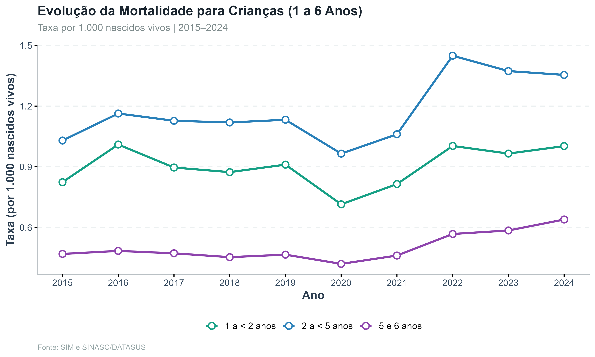{width="100%"}
:::
::: {.column width="50%"}
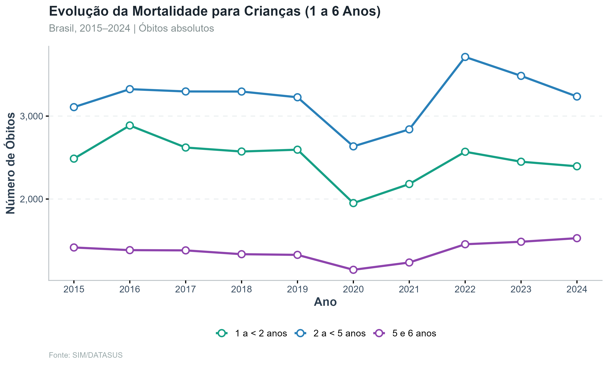{width="100%"}
:::
::::

## Causas de Mortalidade

- Afecções perinatais dominam: responsáveis por mais da metade dos óbitos ao longo do período
- Malformações congênitas são a segunda causa, com participação crescente
- Causas externas e infecciosas ganham relevância ao longo do período
- Taxa total apresenta elevação após 2020, refletindo impacto da pandemia

## Causas de Mortalidade

{fig-align="center" width="90%"}

## Causas por Faixa Etária

- Neonatal precoce e tardio têm 70% e 77% dos óbitos ligados à atenção à gestação e ao parto
- Pós-neonatal: perfil misto, malformações (28%), causas de difícil prevenção (32%), ação prioritária (25%)
- 1 a 6 anos: maioria de causas de difícil prevenção (63%), seguida de ação prioritária (24%)

## Causas de Mortalidade por Faixa Etária

{fig-align="center" width="90%"}

## Desigualdades Regionais da Mortalidade

- Norte apresenta taxa superior ao Sul em mais da sua metade
- Mapa estadual revela Roraima e Amapá com as maiores taxas do país
- A desigualdade persiste em todas as faixas etárias

## Análise Espacial e Desigualdades Regionais da Mortalidade

{fig-align="center" width="90%"}

## Análise Espacial e Desigualdades Regionais da Mortalidade

{fig-align="center" width="50%"}

## Análise Espacial e Desigualdades Regionais da Mortalidade

{fig-align="center" width="50%"}

## Fluxos de Mortalidade e Polos de Ocorrência

- A análise de fluxo cruza o **município de residência** da criança com o **município de ocorrência do óbito**, permitindo identificar deslocamentos assistenciais, dependência regional e concentração de óbitos em polos de saúde infantil.

## Fluxos de Mortalidade

- PE (64,9%) e SE (64,3%) lideram a proporção de óbitos fora do município de residência
- Recife é o maior polo receptor: 8.641 óbitos no período, seguido por São Paulo (5.727) e Belém (5.653)
- A concentração em capitais do Norte e Nordeste evidencia vazios assistenciais nos municípios de origem
- Fluxos intermunicipais refletem alta dependência de centros de referência para atenção neonatal

## Fluxos de Mortalidade e Polos de Ocorrência

{fig-align="center" width="60%"}

## Fluxos de Mortalidade e Polos de Ocorrência

{fig-align="center" width="60%"}

## Fluxos de Mortalidade e Polos de Ocorrência

{fig-align="center" width="60%"}

## Fluxos de Mortalidade e Polos de Ocorrência

{fig-align="center" width="80%"}

## Segmentação Diagnóstica e Polos de Referência

- As causas são segmentadas em grupos diagnósticos de **alta complexidade** e cruzadas com as faixas etárias e com a origem dos pacientes em nível de **município**.\

- As afecções perinatais aparecem destacadas dos demais grupos, e o fluxo de **referência terapêutica** (alta complexidade sem perinatal) é usado para revelar a vocação de cada polo e os deslocamentos efetivos por tratamento.

## Segmentação Diagnóstica

- Afecções perinatais concentram 15.345 óbitos no neonatal precoce
- Cardiopatias congênitas: polo principal em São Paulo (1.410), Porto Alegre (1.098) e Recife (1.083)
- Neoplasias: São Paulo (485), Belém (302) e Recife (294)
- Malformações: Recife lidera com 1.757 óbitos recebidos, revelando forte polo nordestino

## Segmentação Diagnóstica nos Polos

{fig-align="center" width="90%"}

## Polos por Especialidade

{fig-align="center" width="60%"}

## Fluxo Origem ao Polo

{fig-align="center" width="60%"}

## Evolução das Internações

- Taxa de internação em crescimento em todas as faixas etárias ao longo do período
- Menores de 1 ano dominam: 300 internações por mil nascidos vivos
- Queda abrupta na pandemia, seguida de recuperação acima dos níveis pré-pandemia

## Evolução de Internações na Primeira Infância

:::: {.columns}
::: {.column width="50%"}
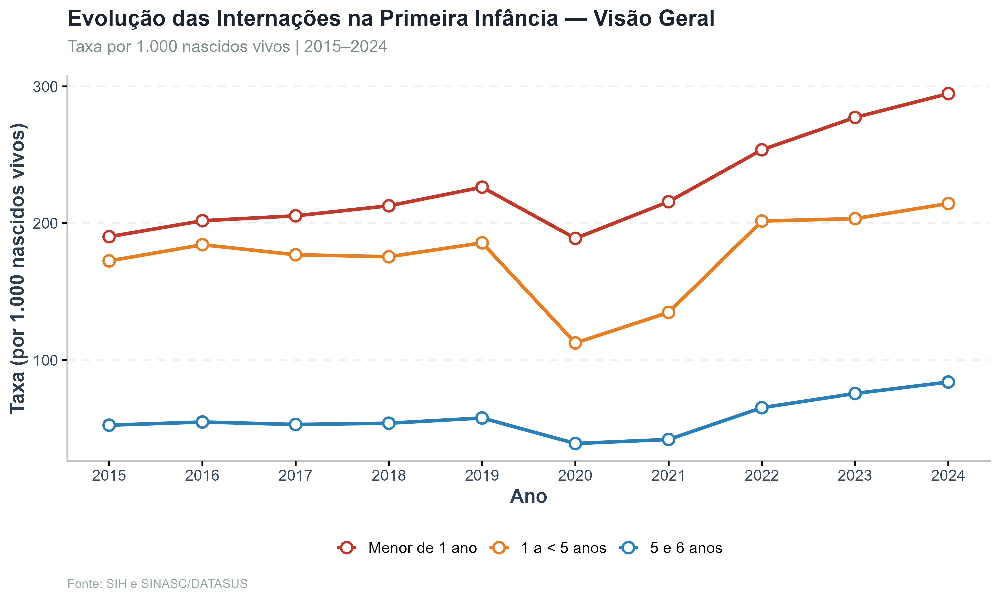{width="100%"}
:::
::: {.column width="50%"}
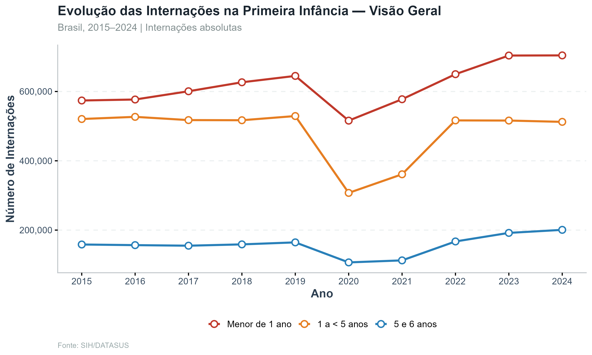{width="100%"}
:::
::::

## Internações Neonatais

- Todas as três faixas neonatais apresentam tendência crescente ao longo do período
- Recuperação pós-pandemia supera os patamares de 2015 em todas as faixas neonatais

## Evolução de Internações para Neonatal

:::: {.columns}
::: {.column width="50%"}
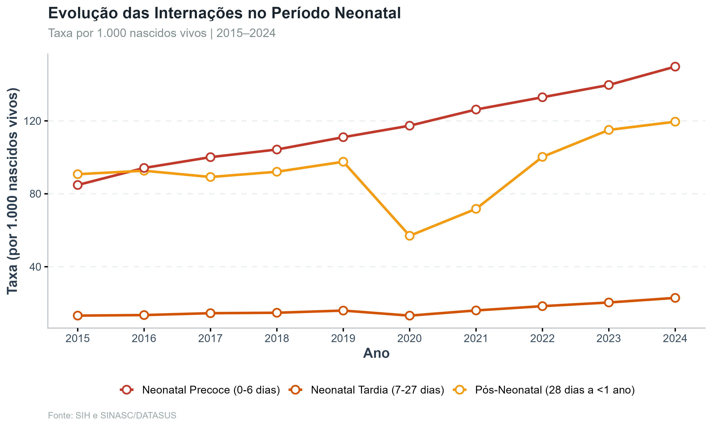{width="100%"}
:::
::: {.column width="50%"}
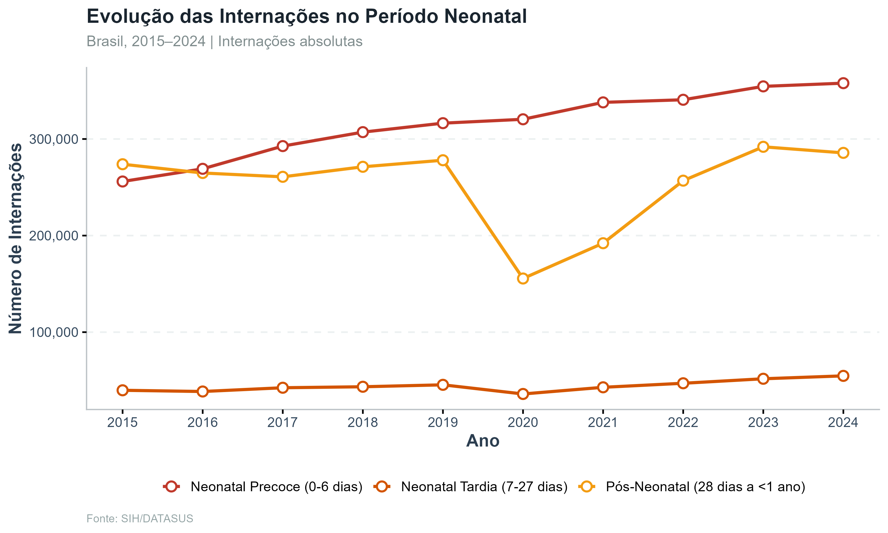{width="100%"}
:::
::::

## Internações em Crianças (1–6 anos)

- 1 a menos de 2 anos lidera: taxa de 120 por mil nascidos vivos, com crescimento acentuado após 2020
- Faixa de 2 a menos que 5 anos: 65 por mil nascidos vivos, crescimento moderado mas consistente

## Evolução de Internações para Crianças

:::: {.columns}
::: {.column width="50%"}
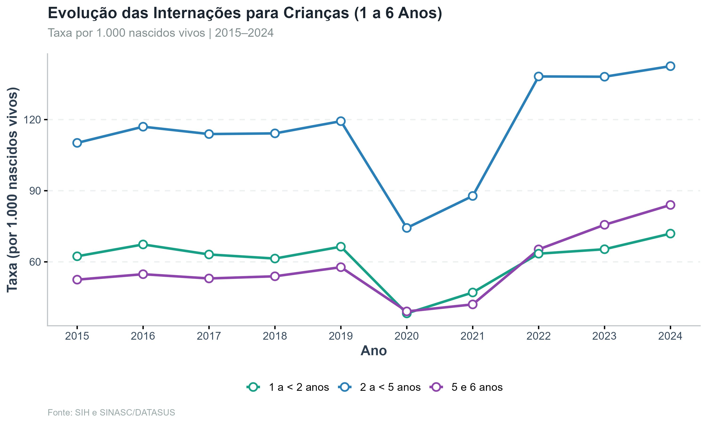{width="100%"}
:::
::: {.column width="50%"}
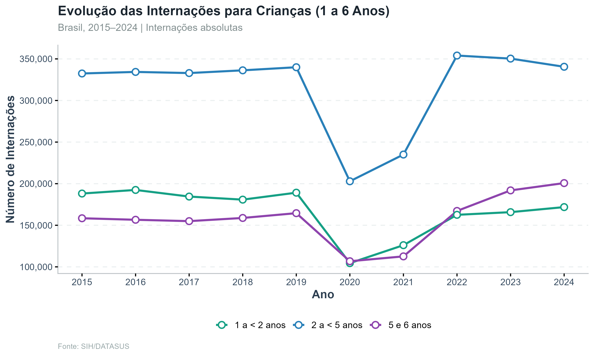{width="100%"}
:::
::::

## Causas de Internação

- Afecções perinatais dominam: maior causa absoluta de internação
- Aparelho respiratório é outra principal causa e está crescendo
- Neonatal precoce: 84% das internações por atenção à gestação e ao parto

## Evolução das Causas de Internação

{fig-align="center" width="90%"}

## Causas Prioritárias de Internação por Faixa Etária

{fig-align="center" width="90%"}

## Desigualdades Regionais das Internações

- Sul tem a maior taxa de internação 480 por mil nascidos vivos, mas a menor mortalidade
- Norte, com menor taxa de internação, apresenta a maior mortalidade -- evidência de vazio assistencial
- Centro-Oeste apresenta taxas intermediárias, com heterogeneidade interna expressiva

## Análise Espacial e Desigualdades Regionais nas Internações

{fig-align="center" width="90%"}

## Análise Espacial e Desigualdades Regionais nas Internações

{fig-align="center" width="60%"}

## Análise Espacial e Desigualdades Regionais nas Internações

{fig-align="center" width="60%"}

## Fluxos Assistenciais e Polos de Atendimento Infantil

- A análise de fluxo das internações cruza o **município de residência** da criança com o **município de internação**, permitindo identificar deslocamentos assistenciais, concentração de atendimentos em polos regionais e dependência de municípios receptores para o cuidado hospitalar infantil.

## Fluxos Assistenciais

- SE (56,6%) e PE (55,4%) lideram a proporção de internações fora do município de residência
- Recife é o maior polo: 260.437 internações recebidas -- o dobro do segundo colocado, Belo Horizonte
- Fortaleza e Brasília disputam o terceiro lugar, ambas com 125 mil internações recebidas

## Fluxos Assistenciais e Polos de Atendimento Infantil

{fig-align="center" width="60%"}

## Fluxos Assistenciais e Polos de Atendimento Infantil

{fig-align="center" width="60%"}

## Fluxos Assistenciais e Polos de Atendimento Infantil

{fig-align="center" width="70%"}

## Fluxos Assistenciais e Polos de Atendimento Infantil

{fig-align="center" width="60%"}

## Óbitos Hospitalares entre Internações

- Esta análise descreve os óbitos hospitalares registrados entre internações de crianças de 0 a 6 anos, permitindo avaliar a magnitude absoluta dos óbitos em ambiente hospitalar e a letalidade hospitalar ao longo do período.

## Óbitos Hospitalares

- 21 mil óbitos hospitalares por ano no período, com queda em 2020 e recuperação posterior
- Recuperação acima do nível pré-pandemia sugere retorno de demanda represada ou piora do quadro clínico

## Óbitos Hospitalares e Letalidade Hospitalar

{fig-align="center" width="80%"}

## Segmentação Diagnóstica e Polos de Referência

- Como o **CEP de residência** consta da AIH, o fluxo de origem é detalhado em nível de **área CEP**, e não apenas por município.\

- As afecções perinatais são analisadas em separado, e o fluxo de **referência terapêutica** (alta complexidade sem perinatal) revela a vocação de cada polo hospitalar.

## Segmentação Diagnóstica

- Afecções perinatais 311.333 internações no neonatal precoce -- causa dominante nessa faixa
- Outras causas e aparelho respiratório: dominam internações de 1 a 6 anos
- Cardiopatias: SP (7.939), Recife (7.187) e BH (7.028) lideram
- Neoplasias: Recife (14.461) e São Paulo (14.418) empatam como maiores polos oncológicos infantis

## Segmentação Diagnóstica nos Polos

{fig-align="center" width="90%"}

## Polos por Especialidade

{fig-align="center" width="60%"}

## Fluxo Origem ao Polo por CEP de Residência

{fig-align="center" width="60%"}

## Conclusão

- Mortalidade infantil em **queda moderada** no período, mas com desaceleração após 2020
- **Afecções perinatais e malformações** concentram maioria dos óbitos neonatais
- Norte e Nordeste com **mortalidade superior** à do Sul, desigualdade que persiste em todas as faixas etárias
- Regiões com menor taxa de internação (Norte) têm maior mortalidade -- evidência de vazio assistencial
- **Recife e São Paulo** emergem como os principais polos nacionais de referência em alta complexidade pediátrica
- Internações cresceram no período, especialmente após a pandemia -- sinal de demanda represada e recuperação do acesso

## Próximos Passos

- **Identificação de vazios assistenciais**: dimensionar municípios sem acesso adequado à maternidade de risco e internação neonatal
- **Cruzamento socioeconômico**: correlacionar taxas com IDH, pobreza e cobertura da atenção primária
- **Indicadores de qualidade**: comparar mortalidade hospitalar por diagnóstico entre polos

## Referências